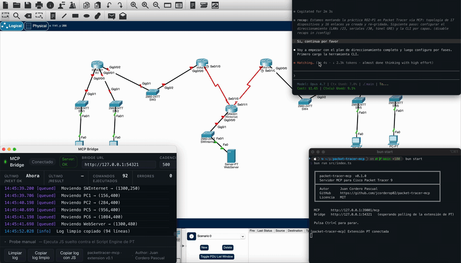

# packet-tracer-mcp


[](https://www.repostatus.org/#wip)


[](https://github.com/jcorderop02/packet-tracer-mcp/issues)

Servidor Model Context Protocol para controlar **Cisco Packet Tracer 9.0**
desde fuera. Una extensión propia se cuelga del editor de PT, abre un
bridge HTTP local y desde ahí el servidor MCP llama a la API IPC nativa
de PT para crear topologías, configurar routers, lanzar simulaciones, etc.
Escrito en TypeScript sobre Bun.

> [!WARNING]
> **Proyecto experimental.** Es la versión 0.1.0, hecha en mis ratos
> libres como experimento personal. Funciona contra PT 9.0.0.0810 en mi
> PC y pasa los smoke tests, pero no la consideres lista para
> producción. Espera bugs, cambios de API y cosas que se rompen al
> actualizar PT. Si te animas a probarla, abre issues con lo que veas.



<sub>Demo acelerada x15: el cliente MCP lanza una receta y el canvas de
Packet Tracer 9 se va llenando solo (devices, cableado, configuración).</sub>

> Autor: Juan Cordero Pascual · Licencia: MIT
> Idiomas: español (este archivo) · [English](./README.en.md)

---

## Tabla de contenidos

- [Por qué otro MCP de Packet Tracer](#por-qué-otro-mcp-de-packet-tracer)
- [Filosofía: canvas-first](#filosofía-canvas-first)
- [Requisitos](#requisitos)
- [Arranque rápido](#arranque-rápido)
  - [Conectar un cliente MCP](#conectar-un-cliente-mcp)
  - [Compilar a binario único](#compilar-a-binario-único)
  - [Tests](#tests)
  - [Recorrido end-to-end](#recorrido-end-to-end)
- [Capacidades](#capacidades)
- [Recetas incluidas](#recetas-incluidas)
- [Configuración](#configuración)
- [Documentación](#documentación)
- [FAQ](#faq)
- [Estructura del proyecto](#estructura-del-proyecto)
- [Estado](#estado)

---

## Por qué otro MCP de Packet Tracer

Los proyectos para PT 6.x–8.x se apoyaban en librerías JS cargadas por
una extensión firmada de terceros. PT 9.0 cerró ese camino: los
`App Meta Files` (`.pta`) ahora tienen que ir firmados con ECDSA por
Cisco, así que ningún proyecto open-source puede entregar uno. La
alternativa que queda es hablar con la webview de PT desde fuera, y eso
es lo que hace este servidor:

- Hay una **extensión `.pts` propia** que se instala desde el menú
  Extensions de PT. Lo único que hace es arrancar un bucle de polling
  contra el bridge HTTP local.
- Cuando el servidor MCP necesita escribir, llama a la **API IPC nativa
  de PT** directamente: cosas como
  `ipc.appWindow().getActiveWorkspace().getLogicalWorkspace().addDevice(...)`
  o `getDevice(...).getCommandLine().enterCommand(...)`. Sin librerías
  intermedias, sin JS opaco copiado de otros sitios.
- Todo el JS que termina ejecutándose en el Script Engine de PT lo
  genera este repo. Si quieres saber qué se está mandando, está en
  `src/ipc/`.

---

## Filosofía: canvas-first

Otras herramientas mantienen un objeto "plan" en memoria, lo validan y
al final lo vuelcan al simulador. Aquí no funciona así:

- **No hay ningún `TopologyPlan` en memoria.** Lo que hay en PT es lo
  que hay; el plan es el canvas.
- **Cada receta vuelve a leer un snapshot del canvas antes de actuar.**
  Si la lanzas dos veces sobre un canvas a medio construir, la segunda
  vez termina lo que faltaba en lugar de duplicar dispositivos. Sale
  idempotente sin tener que pensarlo.
- **La validación se hace contra el canvas vivo**, no contra una
  estructura interna. Cuando algo falla (IPs duplicadas, peers en
  subredes distintas, un router apagado) lo ves directamente en PT, no
  en un grafo abstracto.
- **La persistencia guarda snapshots, no planes.** Volver atrás
  significa comparar el canvas actual con un dump anterior y ver qué
  ha cambiado. No hay rehidratación mágica.

Si quieres el detalle, está en [`docs/ARCHITECTURE.md`](docs/ARCHITECTURE.md).

---

## Requisitos

- Cisco Packet Tracer **9.0** (macOS, Windows o Linux).
- [Bun](https://bun.sh) `>=1.2`. Con Node solo no vale: el código es
  TypeScript y se ejecuta directamente con Bun, sin paso previo de
  compilación.
- La extensión `mcp-bridge.pts` instalada en PT. Viene en el repo en
  `extension/dist/`.

> [!TIP]
> **¿Por qué Bun y no Node?** Bun ejecuta `.ts` nativamente, arranca en
> milisegundos y trae fetch, HTTP y test runner de serie sin instalar
> dependencias. Si solo tienes Node, puedes instalar Bun con
> `curl -fsSL https://bun.sh/install | bash` (o `brew install bun` en
> macOS). Convive con Node sin pisarse.

---

## Arranque rápido

```bash
git clone https://github.com/jcorderop02/packet-tracer-mcp.git
cd packet-tracer-mcp
bun install
bun run start              # streamable-HTTP en :39001 (default)
# o bien:
bun run src/index.ts --stdio   # modo stdio para clientes MCP que lo prefieran
```

En Packet Tracer 9:

1. `Extensions > Scripting > Configure PT Script Modules > Add` y
   selecciona `extension/dist/mcp-bridge.pts`.
2. Marca la extensión como activa.
3. Abre la ventana desde `Extensions > MCP Bridge` una vez por sesión.

El polling arranca solo en cuanto la ventana se carga. Para comprobar
que todo está bien, lanza `pt_bridge_status`: en menos de un segundo
debería responder `connected: true`.

El proceso completo de instalación está en
[`docs/BOOTSTRAP.md`](docs/BOOTSTRAP.md).

El endpoint MCP queda en:

```
http://127.0.0.1:39001/mcp
```

> [!NOTE]
> **Por qué `:39001`.** PT 9 ya tiene su propio IPC nativo (no
> documentado, con handshake firmado por Cisco) escuchando en `:39000`.
> Para no chocar y dejar claro que el servidor MCP es algo aparte, este
> escucha en `:39001`. Si te molesta, cámbialo con la variable de
> entorno `PACKETTRACER_MCP_PORT`.

### Conectar un cliente MCP

<details>
<summary><strong>Claude Code</strong> (CLI, recomendado)</summary>

Una sola línea, sin tocar JSON:

```bash
claude mcp add --transport http packet-tracer http://127.0.0.1:39001/mcp
```

Verifica con `/mcp` dentro de Claude Code: debe aparecer `packet-tracer`
con sus 57 tools.
</details>

<details>
<summary><strong>Claude Desktop</strong></summary>

Edita `~/Library/Application Support/Claude/claude_desktop_config.json`
(macOS) o el equivalente en tu SO y reinicia Claude Desktop:

```json
{
  "mcpServers": {
    "packet-tracer": {
      "url": "http://127.0.0.1:39001/mcp"
    }
  }
}
```
</details>

<details>
<summary><strong>Cursor</strong></summary>

Settings → MCP → Add new MCP server → pega la URL
`http://127.0.0.1:39001/mcp` con transporte `http`.
</details>

<details>
<summary><strong>VS Code</strong> (Continue / Cline)</summary>

En el `config.json` del cliente:

```json
{
  "mcpServers": {
    "packet-tracer": {
      "url": "http://127.0.0.1:39001/mcp"
    }
  }
}
```
</details>

<details>
<summary><strong>Gemini CLI</strong></summary>

Edita `~/.gemini/settings.json`:

```json
{
  "mcpServers": {
    "packet-tracer": {
      "httpUrl": "http://127.0.0.1:39001/mcp"
    }
  }
}
```

Verifica con `/mcp list`.
</details>

<details>
<summary><strong>Codex CLI</strong></summary>

Edita `~/.codex/config.toml`:

```toml
[mcp_servers.packet-tracer]
url = "http://127.0.0.1:39001/mcp"
```
</details>

<details>
<summary><strong>Smoke con <code>curl</code></strong> (sin cliente)</summary>

Para confirmar que el server responde antes de configurar nada:

```bash
curl -sS -X POST http://127.0.0.1:39001/mcp \
  -H "Content-Type: application/json" \
  -H "Accept: application/json, text/event-stream" \
  -d '{"jsonrpc":"2.0","id":1,"method":"initialize","params":{"protocolVersion":"2024-11-05","capabilities":{},"clientInfo":{"name":"smoke","version":"1.0"}}}'
```

Debe devolver un `result` con `serverInfo.name = "packet-tracer-mcp"`. Un
segundo POST con `"method":"tools/list"` devuelve las 57 tools con su
`inputSchema`.
</details>

### Compilar a binario único

```bash
bun run build
./dist/packet-tracer-mcp
```

### Tests

```bash
bun test
```

La suite unitaria cubre la aritmética de subnetting, la inspección del
canvas, el parser de snapshots, los diffs, la validación de blueprints
y los builders CLI de cada receta. **No hace falta PT corriendo para
ejecutarla.**

### Recorrido end-to-end

Con el bridge conectado (`pt_bridge_status` → `connected: true`), una
sesión completa más o menos se ve así:

```text
1. pt_list_recipes                          # confirmar lo disponible
2. pt_forecast recipe='chain' params={routers:3, pcsPerLan:2}
                                            # estimación dry-run, ningún cambio
3. pt_cook_topology recipe='chain'
       params={routers:3, pcsPerLan:2, routing:'ospf'}
                                            # construye el lab; idempotente
4. pt_inspect_canvas                        # findings: IPs duplicadas, etc.
5. pt_explain_canvas                        # narración legible
6. pt_save_snapshot name='chain-baseline'   # captura T-0
7. pt_run_cli device='R1' command='show ip route'
                                            # comprobación rápida desde el CLI
8. pt_diff_snapshots before='chain-baseline'
                                            # qué ha cambiado desde T-0
9. pt_save_pkt path='/abs/path/lab.pkt'     # guardar como .pkt nativo
```

Si algo se ha torcido por el camino, `pt_mend_canvas` aplica
reparaciones conservadoras (encender dispositivos que ya están
cableados pero apagados, ese tipo de cosas) y avisa de lo que no se
atreve a tocar.

---

## Capacidades

`packet-tracer-mcp` expone **57 herramientas MCP** agrupadas por dominio.

### Bridge y diagnóstico

`pt_bridge_status`, `pt_ping`, `pt_clear_canvas`.

### Catálogo y descubrimiento

`pt_list_devices`, `pt_list_modules`, `pt_list_recipes`,
`pt_list_snapshots`, `pt_get_device_details`.

### Inspección del workspace en vivo (read-only)

`pt_query_topology`, `pt_inspect_canvas`, `pt_explain_canvas`,
`pt_forecast` (dry-run de receta), `pt_generate_configs` (genera el
IOS CLI offline de una receta sin tocar PT — útil para documentación,
aulas o reproducir el lab en hardware real), `pt_inspect_ports`
(estado per-puerto: link/up/proto, MAC, IP/máscara, wireless),
`pt_read_vlans` (base VLAN viva por switch), `pt_read_acl` (ACLs
configuradas leídas vía AclProcess), `pt_show_bgp_routes` (parsea
`show ip bgp` en filas estructuradas), `pt_read_project_metadata`
(descripción/versión/filename del .pkt actual).

### Edición primitiva del canvas

`pt_add_device`, `pt_add_module`, `pt_create_link`, `pt_delete_device`,
`pt_delete_link`, `pt_move_device`, `pt_auto_layout` (recoloca todo el
canvas en una rejilla por capas, detecta routers de tránsito y los baja
a un segundo piso), `pt_rename_device`, `pt_set_pc`,
`pt_set_device_power` (toggle Device.setPower idempotente),
`pt_add_canvas_annotation` (notas/líneas/círculos),
`pt_manage_clusters` (lista/elimina/disuelve clusters lógicos),
`pt_send_raw` (vía de escape: ejecuta JS arbitrario en el Script
Engine).

### Edición a nivel de receta (orquestación)

`pt_cook_topology`, `pt_mend_canvas`, `pt_plan_review` (revisión
pre-flight obligatoria para topologías de ≥3 routers), `pt_apply_switching`,
`pt_apply_services`, `pt_configure_server_dhcp` (DHCP server en Server-PT
vía API IPC nativa), `pt_configure_subinterface` (sub-interfaces 802.1Q
para router-on-a-stick), `pt_apply_advanced_routing`, `pt_apply_ipv6`,
`pt_apply_voip`, `pt_apply_wireless`.

### Persistencia (snapshots)

`pt_save_snapshot`, `pt_load_snapshot`, `pt_diff_snapshots`. Los
snapshots se guardan en disco como un dump del canvas. Cargar uno no
sobreescribe nada: te enseña la diferencia contra lo que tienes ahora
mismo en PT y tú decides.

### Persistencia `.pkt` nativa

`pt_save_pkt`, `pt_open_pkt` (cuando el servidor y PT comparten
filesystem), más `pt_save_pkt_to_bytes` y `pt_open_pkt_from_bytes` para
mover el `.pkt` por la red. El formato comprimido `.pkz` no funciona:
la API JS expone los métodos pero los bytes que devuelve no son válidos
en PT 9.0.0.0810.

### CLI de routers y switches

`pt_run_cli`, `pt_run_cli_bulk`, `pt_show_running` (con `| section`
opcional).

### Simulación y operaciones

`pt_simulation_mode` (toggle Realtime↔Simulation), `pt_simulation_play`
(play/back/forward/reset), `pt_send_pdu` (Simple PDU originado),
`pt_traceroute`, `pt_screenshot` (PNG/JPG del workspace).

---

## Recetas incluidas

`pt_list_recipes` devuelve la lista al vuelo. Las que vienen de fábrica:

| Receta | Descripción |
|--------|-------------|
| `chain` | N routers en serie, cada uno con su LAN de M PCs. |
| `star` | router *hub* con N *spokes*, cada *spoke* con su LAN. |
| `branch_office` | HQ con una o dos LANs y un router de sucursal con la suya. |
| `campus_vlan` | router-on-a-stick: un router + un switch con N VLANs y M PCs por VLAN. |
| `edge_nat` | router de borde con PAT, DHCP, ACL y router ISP upstream. |
| `dual_isp` | dos ISPs con BGP eBGP + HSRP en routers de borde. |
| `voip_lab` | router CME + switch + N IP Phones 7960; provisiona telephony-service, ephone-dn, voice VLAN y DHCP option-150. |
| `ipv6_lab` | dual-stack IPv4 + IPv6 con OSPFv3. |
| `wifi_lan` | router + AccessPoint + laptops. **Limitada**: la API JS pública de PT 9 no dispara la asociación radio (ver `docs/COVERAGE.md`). |

Las primeras tres admiten `routing: 'static' | 'ospf' | 'eigrp' | 'rip' |
'none'` y `dhcp: true|false`. `campus_vlan` acepta además `startVlanId`,
`vlanStep` y `lanPool`. `wifi_lan` acepta `ssid`, `security`, `psk` y
`channel`.

---

## Configuración

Variables de entorno (todas opcionales):

| Variable | Por defecto | Significado |
|----------|-------------|-------------|
| `PACKETTRACER_MCP_HOST` | `127.0.0.1` | Host del transporte HTTP MCP. Pon `0.0.0.0` para acceso LAN. |
| `PACKETTRACER_MCP_PORT` | `39001` | Puerto MCP (evita el `:39000` del IPC nativo de PT). |
| `PACKETTRACER_BRIDGE_PORT` | `54321` | Puerto que sondea la webview de PT. |
| `PACKET_TRACER_SNAPSHOT_DIR` | `./packet-tracer-snapshots` | Directorio para snapshots persistidos. |

---

## Documentación

- [`AGENTS.md`](AGENTS.md) — guía operativa para LLMs que usen este
  servidor: convenciones de cableado (LAN Gigabit vs WAN serial), LANs
  de usuario vs de tránsito, flujo recomendado de creación + auto
  layout, errores típicos a evitar.
- [`docs/ARCHITECTURE.md`](docs/ARCHITECTURE.md) — capas (transporte
  MCP, tools, recetas, generadores IPC, bridge HTTP), por qué
  canvas-first, persistencia `.pkt`, qué queda fuera de alcance.
- [`docs/BOOTSTRAP.md`](docs/BOOTSTRAP.md) — instalación de la
  extensión `.pts`, anatomía del polling, sección para desarrolladores
  que quieran reconstruir el `.pts`.
- [`docs/COVERAGE.md`](docs/COVERAGE.md) — qué está verificado contra
  PT 9 real, en qué estado (`verified-pt9` / `contract-verified` /
  `partial` / `broken` / `dead-end`), referencias a smoke runs y
  limitaciones conocidas del simulador que afectan al usuario.
- [`docs/TOOLS.md`](docs/TOOLS.md) — referencia de las 57 tools MCP,
  con parámetros, comportamiento y notas.
- [`docs/RECIPES.md`](docs/RECIPES.md) — catálogo de recipes (`chain`,
  `star`, `branch_office`, `campus_vlan`, `edge_nat`, `wifi_lan`,
  `voip_lab`, `ipv6_lab`, `dual_isp`) con parámetros, ejemplos y
  resultado esperado.
- [`docs/TROUBLESHOOTING.md`](docs/TROUBLESHOOTING.md) — síntomas
  reales, causa probable y fix. La FAQ de aquí abajo es el resumen.
- [`CHANGELOG.md`](CHANGELOG.md) — qué entra en cada release, en
  formato [Keep a Changelog](https://keepachangelog.com).
- [`CONTRIBUTING.md`](CONTRIBUTING.md) — cómo abrir issues, setup
  local, convenciones de código y commits.
- [`CODE_OF_CONDUCT.md`](CODE_OF_CONDUCT.md) — Contributor Covenant
  2.1.
- [`SECURITY.md`](SECURITY.md) — política de seguridad y reporte de
  vulnerabilidades.

---

## Estructura del proyecto

```
src/
  bridge/        Bridge HTTP que sondea la webview de PT
  canvas/        Snapshot, inspección, diff y aritmética de subnetting
  catalog/       Modelos PT (54), alias humanos, tipos de cable
  ipc/           Generadores puros string-in/string-out para el IPC nativo
                 + persistencia .pkt vía systemFileManager
  recipes/       Blueprints, addressing, routing, switching, services,
                 ipv6, voip, wireless, topologías predefinidas
  persistence/   Persistencia de snapshots
  tools/         Un fichero por tool MCP; ALL_TOOLS los agrega
  config.ts      Configuración por entorno
  server.ts      Ciclo de vida (transporte MCP + bridge)
  index.ts       Entry-point CLI
extension/       Extensión .pts (módulo PT que arranca el polling)
docs/            Arquitectura, bootstrap y matriz de cobertura
scripts/         smoke.ts (suite de verificación contra PT real)
```

---

## FAQ

<details>
<summary><b>¿Para qué sirve esto exactamente?</b></summary>

Para que un LLM (Claude, ChatGPT, Gemini, lo que sea con cliente MCP)
pueda crear, configurar y validar topologías en Packet Tracer 9 sin
que tú toques el GUI. Útil para preparar laboratorios CCNA/CCNP,
generar escenarios de prácticas, o automatizar tareas repetitivas.

</details>

<details>
<summary><b>¿Funciona sin Packet Tracer corriendo?</b></summary>

Las llamadas read-only que no tocan el canvas (catálogo, listar
recetas, validar planes) funcionan sin PT. Cualquier cosa que toque la
topología (`pt_add_device`, `pt_cook_topology`, `pt_run_cli`, etc.)
necesita PT abierto y la extensión cargada.

</details>

<details>
<summary><b>¿Qué versiones de Packet Tracer soporta?</b></summary>

Solo **9.0.0.0810**. La API IPC nativa cambia entre minor versions de
PT y este servidor está calibrado contra esa build. Versiones anteriores
(8.x) no tienen el Script Engine moderno y no van a funcionar.

</details>

<details>
<summary><b>¿Por qué Bun y no Node?</b></summary>

Por comodidad, sobre todo. Bun ejecuta TypeScript sin transpilación,
arranca en pocos milisegundos (importa cuando un cliente MCP relanza
el servidor varias veces al día) y `bun build --compile` saca un
binario standalone que puedes mover a otra máquina sin instalar nada.
Node funcionaría también; simplemente acabé prefiriendo el flujo de
Bun para esto.

</details>

<details>
<summary><b>¿Tiene autenticación?</b></summary>

No. Asume entorno local de confianza (loopback). Si abres el puerto a
la LAN con `PACKETTRACER_MCP_HOST=0.0.0.0`, la responsabilidad de
proteger el puerto es tuya. Mira [`SECURITY.md`](SECURITY.md).

</details>

<details>
<summary><b>¿Qué hago si una receta se cuelga?</b></summary>

Llama a `pt_clear_canvas`, baja los parámetros (menos routers/VLANs) y
vuelve a probar. Si lo reproduces de forma fiable, abre un issue con
los parámetros exactos. Más detalle en
[`docs/TROUBLESHOOTING.md`](docs/TROUBLESHOOTING.md).

</details>

<details>
<summary><b>¿Puedo añadir mis propias recetas?</b></summary>

Sí. Sigue el patrón de `src/recipes/topologies/*.ts`, exporta una
función que devuelva un `Blueprint`, y regístrala en
`src/recipes/index.ts`. Mira
[`CONTRIBUTING.md`](CONTRIBUTING.md).

</details>

### Errores frecuentes (respuesta corta)

| Síntoma | Fix rápido |
|---------|------------|
| Cliente MCP no conecta | `lsof -i :39001` → si no hay nada, arranca `bun run src/index.ts`. |
| `pt_bridge_status` → `connected: false` | Pega el bootstrap del README en el editor de scripts de PT y pulsa Run. |
| Canvas no se mueve | El polling se paró: vuelve a pegar el bootstrap. |
| `pt_run_cli` devuelve vacío | Repite la llamada — `terminal length 0` se aplica al primer `enable`. |
| `bun install` falla | `bun --version` ≥ 1.2 y `rm -rf node_modules bun.lock && bun install`. |

Lista completa en [`docs/TROUBLESHOOTING.md`](docs/TROUBLESHOOTING.md).

---

## Estado

Probado contra **Cisco Packet Tracer 9.0.0.0810**:

- **54 / 54** modelos del catálogo etiquetados como `verified-pt9`.
- **57 tools MCP** con sus tests unitarios.
- **8 de 9 recetas** verificadas de principio a fin (`chain`, `star`,
  `branch_office`, `campus_vlan`, `edge_nat`, `dual_isp`, `voip_lab`,
  `ipv6_lab`). La novena, `wifi_lan`, se queda a medias por una
  limitación de la API de PT (no del MCP).
- Capas validadas end-to-end: switching L2, servicios L3 (NAT, ACL,
  DHCP), routing dinámico (OSPF, BGP, HSRP, EIGRP), IPv6 con OSPFv3,
  VoIP (CME + ephone-dn), simulación y operaciones, y persistencia
  `.pkt`.

La evidencia detallada (smoke runs, capturas de pantalla y limitaciones
conocidas) está en [`docs/COVERAGE.md`](docs/COVERAGE.md).
