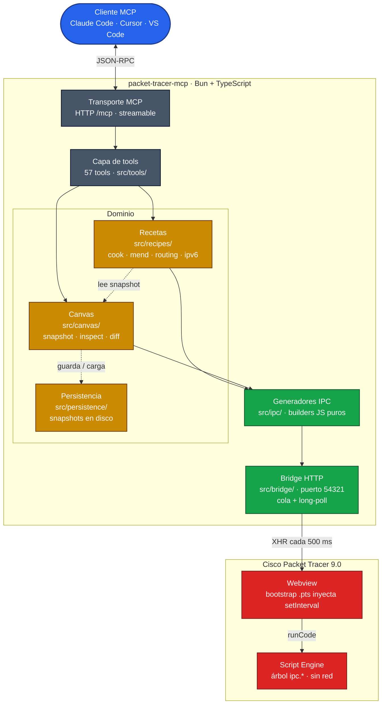

# Arquitectura

`packet-tracer-mcp` es un servidor MCP con enfoque *canvas-first* para
Cisco Packet Tracer 9.0. No hay un simulador embebido, no hay un
`TopologyPlan` flotando en memoria y tampoco una copia local de la red.
La única fuente de verdad es el workspace que tienes abierto en PT:
cada lectura le pregunta, cada escritura le muta y cada receta arma sus
operaciones a partir del snapshot que acaba de capturar.

## Capas

> [!NOTE]
> Leyenda de colores: **azul** = cliente externo · **gris** = capa
> servidor (transporte + tools) · **amarillo** = dominio (lo que toca
> el canvas vivo) · **verde** = la frontera donde el servidor empieza
> a hablar con PT (IPC + bridge HTTP local) · **rojo** = lo que corre
> dentro de Packet Tracer. Todo lo verde y todo lo rojo se queda en tu
> máquina; nada sale a Cisco.

Persistencia (`src/persistence/`) vive al lado de la capa canvas:
guarda *snapshots* en disco, nunca planes, así que recargar un proyecto
significa diffear la verdad de ayer contra la de hoy. Los archivos
binarios `.pkt` nativos de PT se manejan aparte vía `src/ipc/files.ts`.

## Tools MCP (57 en `src/tools/`)

Cada tool es un módulo independiente con su propio esquema de entrada,
su builder JS y su decoder. Agruparlas por dominio:

- **Bridge / lifecycle**: `pt_bridge_status`, `pt_ping`,
  `pt_clear_canvas`.
- **Pre-flight planning**: `pt_plan_review` (revisión obligatoria
  antes de escribir sobre topologías de ≥3 routers).
- **Catálogo y descubrimiento**: `pt_list_devices`, `pt_list_modules`
  (modo catálogo y modo per-device), `pt_list_recipes`,
  `pt_get_device_details`.
- **Edición primitiva del canvas**: `pt_add_device`, `pt_add_module`,
  `pt_create_link`, `pt_delete_device`, `pt_delete_link`,
  `pt_rename_device`, `pt_move_device`, `pt_auto_layout`, `pt_set_pc`,
  `pt_set_device_power`, `pt_add_canvas_annotation`,
  `pt_manage_clusters`, `pt_send_raw`.
- **Inspección read-only del canvas**: `pt_inspect_canvas`,
  `pt_explain_canvas`, `pt_query_topology`, `pt_inspect_ports`,
  `pt_read_vlans`, `pt_read_acl`, `pt_show_bgp_routes`,
  `pt_read_project_metadata`.
- **Snapshots y reparación**: `pt_save_snapshot`, `pt_load_snapshot`,
  `pt_list_snapshots`, `pt_diff_snapshots`, `pt_mend_canvas`.
- **CLI**: `pt_run_cli`, `pt_run_cli_bulk`, `pt_show_running`.
- **Recetas y orquestación**: `pt_cook_topology`, `pt_forecast`,
  `pt_generate_configs` (synthesis offline sin tocar PT).
- **Aplicadores especializados**: `pt_apply_switching`,
  `pt_apply_services`, `pt_configure_server_dhcp`,
  `pt_configure_subinterface`, `pt_apply_advanced_routing`,
  `pt_apply_ipv6`, `pt_apply_voip`, `pt_apply_wireless`.
- **Persistencia .pkt nativa**: `pt_save_pkt`, `pt_open_pkt`,
  `pt_save_pkt_to_bytes`, `pt_open_pkt_from_bytes`.
- **Simulación y operaciones**: `pt_simulation_mode`,
  `pt_simulation_play`, `pt_send_pdu`, `pt_ping`, `pt_traceroute`,
  `pt_screenshot`.

Mantenerlas separadas habilita servidores composables (build read-only,
build solo-lab, etc.) re-exportando subconjuntos de `ALL_TOOLS`.

## Recetas (`src/recipes/`)

Las recetas son *intents* declarativos: descripciones de qué quieres
montar. Al ejecutarlas, el servidor las traduce a una secuencia
idempotente de operaciones sobre el canvas más comandos CLI. Patrón:

1. `intents.ts` — tipos `readonly` declarativos.
2. `cli.ts` — builders puros que generan strings de configuración IOS
   (testeable sin PT).
3. `apply.ts` — appliers async que agrupan por dispositivo, envuelven
   en `enable\nconfigure terminal\n…\nend` con `wrapInConfig`, despachan
   vía `bulkCliJs(device, body)` y devuelven un `Report` con `actions`
   y `skipped`.

`cook.ts` es el orquestador: aplica blueprints en el orden
`devices → links → addressing → routing → switching → services → ipv6 →
voip → wireless → extraCli`. Al final, vuelve a snapshotear y verifica
contra el canvas vivo.

Recetas de topología disponibles (`src/recipes/topologies/`):
`chain`, `star`, `branch_office`, `campus_vlan`, `edge_nat`, `wifi_lan`,
`dual_isp`, `voip_lab`, `ipv6_lab`.

## Catálogo de dispositivos (`src/catalog/`)

54 modelos PT 9 verificados (`verified-pt9` contra
PT 9.0.0.0810): G1/G2 ISR, ISR4xxx, branch/industrial (819HG, CGR1240,
IR1101, IR8340), IE-2000/3400/9320, ASAs (5505, 5506-X, ISA-3000),
genéricos PT (Router-PT, Switch-PT) y endpoints (PC, Server, Laptop,
Printer, TabletPC, SMARTPHONE, TV, Home-VoIP, IP Phone 7960, etc.).

Atributo clave: **`cliMode`** distingue la personalidad de arranque
del CLI:

- `"ios"` (default) — prompt `Router>`/`Switch>` directo.
- `"rommon"` — arranca en ROM Monitor; comandos IOS no aplican
  (único: `PT8200`).
- `"pnp"` — IOS XE 17.x con `Enter enable secret:` mandatorio en boot
  (rechaza diccionario+secuencias). Modelos: `IR1101`, `IR8340`,
  `IE-9320`. El probe inyecta password fuerte automáticamente.

`src/catalog/devices.ts` también lista 33 alias humanos (`router`,
`switch`, `pc`, `phone`, …) para que las tools acepten input natural.

## Por qué un bridge

El Script Engine de PT no tiene primitivas de red. Lo único que sí
puede entrar y salir datos al exterior es la página QtWebEngine que
hospeda el editor: esa página sí tiene `XMLHttpRequest`. El bridge,
por tanto, no es una elección de diseño elegante; es el pegamento
mínimo necesario para hablar con PT desde fuera. La implementación
usa `Bun.serve` porque trae HTTP nativo sin dependencias y permite
empaquetarlo todo en un binario único.

## Por qué canvas-first

Un planner-then-deploy clásico acaba validando ficción. El plan en
memoria pinta bien, pero en cuanto el canvas se desvía un poco (una
edición manual, un run a medias, un dispositivo renombrado a mano), el
plan se queda viejo y el usuario no tiene cómo enterarse. Si el canvas
vivo es lo único en lo que confía cada capa, salen tres propiedades
gratis:

1. **Idempotencia por defecto.** Cada receta vuelve a hacer snapshot
   antes de actuar, así que relanzarla sobre un canvas a medio hacer
   termina lo que faltaba en lugar de duplicar.
2. **Validación honesta.** `pt_inspect_canvas` te dice qué está mal en
   el workspace real (IPs duplicadas, peers en subredes distintas,
   dispositivos apagados), nunca en un plan que solo existe en RAM.
3. **Persistencia reversible.** Los snapshots guardan lo que había;
   cargar uno es un diff contra lo que hay, así que ves el delta antes
   de aplicar nada.

## Por qué los builders IPC devuelven strings

El Script Engine procesa una expresión a la vez vía
`$se('runCode', ...)`. Cada builder devuelve una expresión JS
auto-contenida para que el bridge pueda mandarlas independientemente.
Para forzar esa auto-contención envolvemos los cuerpos de varias
sentencias en IIFEs `(function(){ ... })()`, así las variables locales
no se escapan entre llamadas.

## Protocolo de resultado

Para las tools que necesitan devolver un valor, el envoltorio que monta
`Bridge.sendAndWait` genera un JS que hace lo siguiente:

1. Evalúa la expresión, capturando el valor de retorno o el error si
   se lanza alguno.
2. Convierte el resultado a string y lo codifica en hex carácter a
   carácter.
3. Llama a `window.webview.evaluateJavaScriptAsync` para que sea la
   webview (que sí tiene HTTP) la que postee el hex a `/result`.
4. El handler `/result` del bridge decodifica el hex y resuelve la
   `Promise` que estaba esperando del lado del servidor.

La codificación hex es para no pelearse con escapes Unicode al cruzar
la frontera Script Engine ↔ webview.

## Persistencia `.pkt` nativa

Los archivos `.pkt` (formato binario propio de Packet Tracer) se
guardan y cargan vía `src/ipc/files.ts`, que envuelve la API
`ipc.systemFileManager()` del Script Engine en cuatro tools:

- `pt_save_pkt` — escribe el canvas vivo a una ruta en disco.
- `pt_open_pkt` — lee un `.pkt` desde disco y lo carga en el canvas
  (sustituye lo que hubiera).
- `pt_save_pkt_to_bytes` / `pt_open_pkt_from_bytes` — variantes que
  trabajan con el contenido binario en memoria, útiles para clientes
  MCP que no comparten filesystem con PT.

La carga es transparente para el resto de capas: el siguiente
`captureSnapshot` ve el contenido del fichero abierto sin que las
recetas tengan que adaptar nada. El formato comprimido `.pkz` no es
soportado: la API JS expone los métodos pero no produce bytes válidos
en PT 9.0.0.0810 (verificado por probe, ver `docs/COVERAGE.md`).

## Fuera de alcance

- **Una UI gráfica.** Este proyecto es el motor; dibujar la topología
  y editarla visualmente sigue siendo trabajo de PT.
- **Reactividad por eventos del Script Engine.** El método
  `registerObjectEvent` aparece en la API JS, pero acepta cualquier
  nombre de evento sin validar y nunca dispara callbacks. Por eso todas
  las verificaciones del MCP se hacen volviendo a hacer snapshot del
  canvas, no esperando push.
- **El IPC nativo firmado de Cisco.** PT 9 tiene un canal IPC
  privilegiado al que solo se entra con un `.pta` firmado con ECDSA
  por Cisco. Para una extensión de terceros eso no es viable, así que
  el camino que usa el proyecto es bridge HTTP + Script Engine, y de
  ahí no se mueve.
- **Asociación radio del cliente wireless.** `setSsid` y
  `setEncryptType` se persisten contra el modelo de PT, pero la API JS
  no expone forma de que el cliente *asocie* contra un AP. El contador
  de redes vistas se queda en cero, así que la receta `wifi_lan` se
  marca como `partial`.
- **Creación programática de clusters lógicos.**
  `LogicalWorkspace.addCluster()` opera sobre la selección actual del
  UI y no hay IPC para programarla desde fuera. `pt_manage_clusters`
  cubre `list`, `remove` y `uncluster`, pero no `create`.
- **Inspección nativa de la tabla BGP.** En PT 9 no existe
  `BgpProcess` en la API JS, así que `pt_show_bgp_routes` parsea la
  salida textual de `show ip bgp`, que es la única vía que queda.
